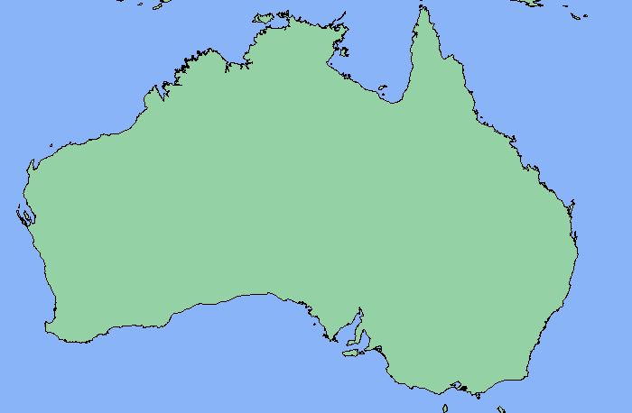
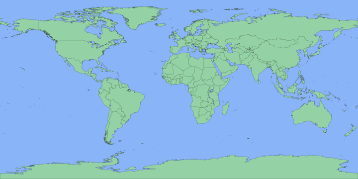
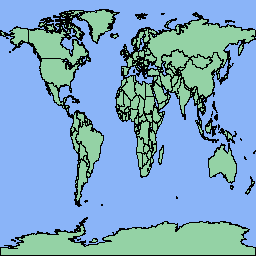

# Map Generator
Generates a world map from a shapefile of country boundaries.

This application is mainly a demo of three header only libraries.

1. `shapefile.hpp`: A library for reading ESRI [Shapefiles](https://www.esri.com/content/dam/esrisites/sitecore-archive/Files/Pdfs/library/whitepapers/pdfs/shapefile.pdf).
2. `image.hpp`: A library for drawing basic images and saving them to bitmap files.
3. `polygon.hpp`: A library for handling polygon shapes.

## Compile
```bash
make
```
This will build the software in `./build/`.

## Run
### First Run Setup
Before running the software for the first time, maps can be downloaded using:

```bash
make maps
```

This downloads shapefiles from: https://www.naturalearthdata.com/downloads/.
The 50m and 10m resolution maps will be stored in `./maps/`.

### Basic Example
To generate a world map:
```bash
./build/map_gen ./maps/ne_50m_admin_0_countries_lakes.shp > map_50m.bmp
./build/map_gen ./maps/ne_10m_admin_0_countries_lakes.shp > map_10m.bmp
```
Note that the program outputs to `stdout`, and therefore the output needs to be redirected to a file or piped to another application.

### Usage
```bash
map_gen <path_to_map_shapefile> [image_width] [image_height]
map_gen <path_to_map_shapefile> x_min x_max y_min y_max [image_width] [image_height]
```

If an `image_width` is not specified, a default value of 3600px is used, and the `image_height` is automatically scaled to preserve the aspect ratio of the map.

#### Example 1
Generate a map of Australia with a width of 700px and a height set automatically to preserve map aspect ratio:
```bash
./build/map_gen ./maps/ne_10m_admin_0_countries_lakes.shp 111.72 157.51 -40.15 -10.25 700 > aus.bmp
```


#### Example 2
Generate a world map (3600px x 1800px) and pass to imagemagick to resize to 20% the original size and then convert to `PNG`.
```bash
./build/map_gen ./maps/ne_50m_admin_0_countries_lakes.shp | convert - -resize "20%" map_50m.png
```


#### Example 3
Generate a world map with a forced size of 256px x 256px.
```bash
./build/map_gen ./maps/ne_50m_admin_0_countries_lakes.shp  256 256 > squashed.bmp
```
