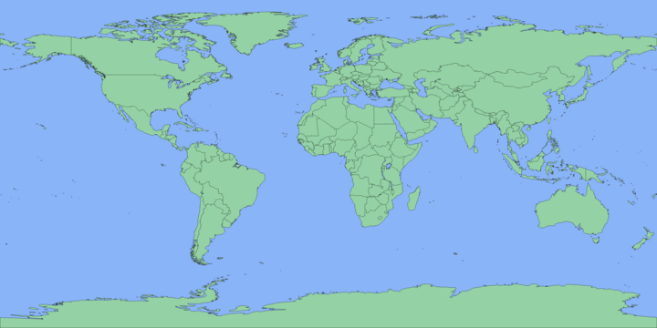

# Map Generator
Generates a world map from a shapefile of country boundaries.



This application is mainly a demo of three header only libraries.

1. `shapefile.hpp`: A library for reading ESRI [Shapefiles](https://www.esri.com/content/dam/esrisites/sitecore-archive/Files/Pdfs/library/whitepapers/pdfs/shapefile.pdf).
2. `image.hpp`: A library for drawing basic images and saving them to bitmap files.
3. `polygon.hpp`: A library for handling polygon shapes.

## Compile
```bash
make
```
This will build the software in `./build/`.

## Run
Before running the software for the first time, maps can be downloaded using:

```bash
make maps
```

This downloads shapefiles from: https://www.naturalearthdata.com/downloads/
The 50m and 10m resolution maps will be stored in `./maps/`.

To generate a map:
```bash
./build/map_gen ./maps/ne_50m_admin_0_countries_lakes.shp > map_50m.bmp
./build/map_gen ./maps/ne_10m_admin_0_countries_lakes.shp > map_10m.bmp
```

To pass to imagemagick for resizing or converting to another file format:
```bash
./build/map_gen ./maps/ne_50m_admin_0_countries_lakes.shp | convert - -resize "50%" map_50m.png
```